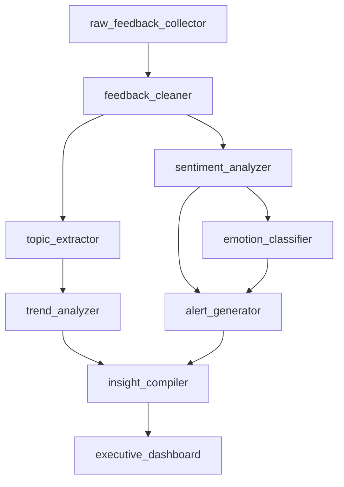

# Customer Analytics Pipeline Example

This example demonstrates how to use PBT's `ref()` function to build a complete customer analytics pipeline with proper dependency management.

## Pipeline Overview



## Pipeline Stages

### 1. Raw Feedback Collection
- **File**: `prompts/raw_feedback_collector.yaml`
- **Purpose**: Gather customer feedback from various sources
- **Dependencies**: None (source node)

### 2. Data Cleaning
- **File**: `prompts/feedback_cleaner.yaml`
- **Purpose**: Clean and standardize feedback data
- **Dependencies**: `ref('raw_feedback_collector')`

### 3. Parallel Analysis
- **Sentiment Analysis**: `prompts/sentiment_analyzer.yaml`
- **Topic Extraction**: `prompts/topic_extractor.yaml`
- Both depend on: `ref('feedback_cleaner')`

### 4. Deep Analysis
- **Emotion Classification**: `prompts/emotion_classifier.yaml`
  - Depends on: `ref('sentiment_analyzer')`
- **Trend Analysis**: `prompts/trend_analyzer.yaml`
  - Depends on: `ref('topic_extractor')`

### 5. Alert Generation
- **File**: `prompts/alert_generator.yaml`
- **Dependencies**: 
  - `ref('sentiment_analyzer')`
  - `ref('emotion_classifier')`

### 6. Insight Compilation
- **File**: `prompts/insight_compiler.yaml`
- **Dependencies**:
  - `ref('alert_generator')`
  - `ref('trend_analyzer')`

### 7. Executive Dashboard
- **File**: `prompts/executive_dashboard.yaml`
- **Dependencies**: `ref('insight_compiler')`

## Running the Pipeline

```bash
# View the dependency graph
pbt deps --format mermaid

# Run the entire pipeline
pbt run executive_dashboard

# Run with production profile
pbt run executive_dashboard --profile production

# Run only sentiment analysis branch
pbt run alert_generator
```

## Benefits of Using ref()

1. **Automatic Execution Order**: PBT determines the correct order to run prompts
2. **Parallel Execution**: Independent prompts run simultaneously
3. **Partial Runs**: Run only the prompts you need and their dependencies
4. **Change Impact**: See which prompts are affected by changes
5. **Testing**: Test individual prompts or entire pipelines

## Testing the Pipeline

```bash
# Test individual prompts
pbt test prompts/sentiment_analyzer.yaml

# Test the entire pipeline
pbt test prompts/executive_dashboard.yaml --recursive

# Validate all dependencies
pbt deps --validate
```

## Monitoring

```bash
# View run history
pbt run --profile production
cat .pbt/run_results.json

# Check performance metrics
pbt metrics --prompt executive_dashboard
```